<div align="center">
  <br/>
  <h1>English Assistant</h1>
  <p><b>An all-in-one English learning companion for Chinese-speaking IELTS learners</b></p>
  <br/>

  <p>
    
    
    
    
    
    
  </p>

  <br/>
</div>

---

English Assistant 是一个面向 Chinese-speaking IELTS 学习者的英语学习 Web 应用，融合 **词汇 SRS（间隔重复）**、**精听训练**、**Reading 推文阅读**、**AI 口语教练** 四大核心模块，内容由 DeepSeek 实时生成，覆盖日常生活、学术、专业领域（机械工程、计算机/AI、汽车、外贸）等场景。

<br/>

<div align="center">
  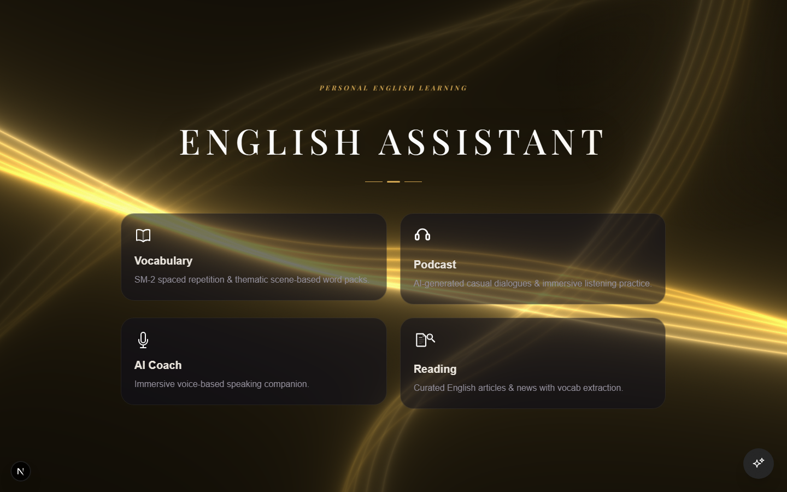
</div>

<br/>

## ✨ Features

### 📖 Reading — 阅读中积累词汇
<div align="center">
  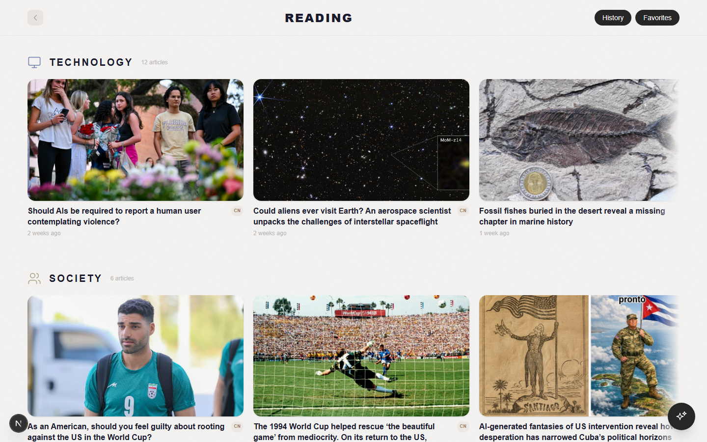&nbsp;&nbsp;
  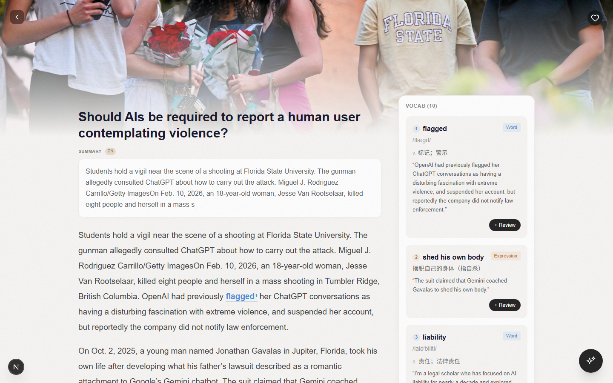
</div>

- 自动抓取 **The Conversation** RSS，每日更新英文推文
- DeepSeek 自动提取词汇 + 生成中文摘要
- 右侧 sticky 词汇面板，**word** 可加入 SRS 记忆库，**phrase / expression** 随看随学
- 正文彩色下划线标注，点击即查

### 📝 Vocabulary SRS — 智能记忆
<div align="center">
  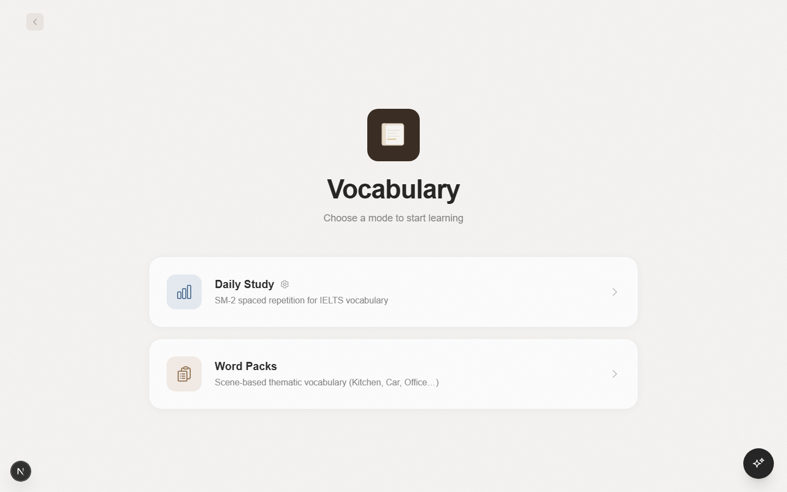&nbsp;&nbsp;
  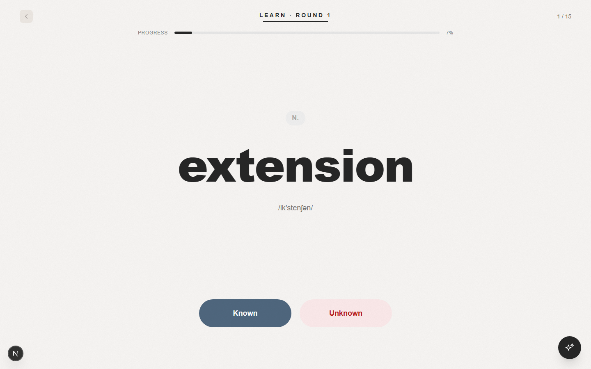&nbsp;&nbsp;
  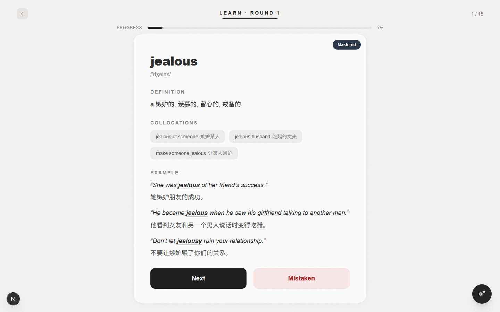
</div>

- **2000 IELTS 核心词汇**（550 手写精编 + 1450 AI 生成）
- **SM-2 遗忘曲线算法**，双队列看板（待复习 → 掌握）
- 20 个主题场景词包（厨房 / 汽车 / 机械工程 / 外贸 / 计算机…）
- 每日目标追踪 + Custom word pack 自定义词包

### 🎧 Listening — 精听唱片机
<div align="center">
  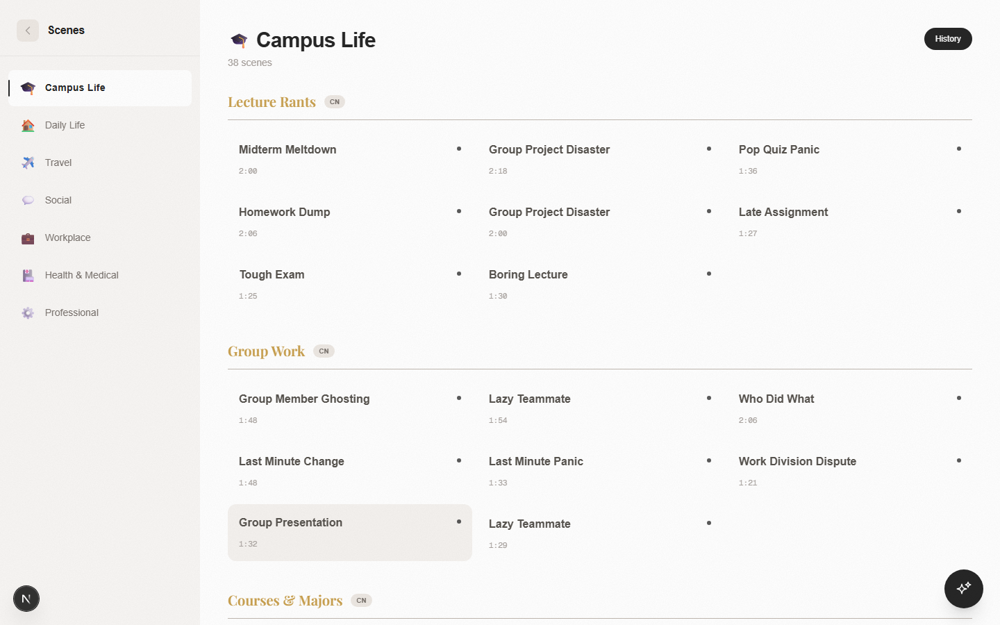&nbsp;&nbsp;
  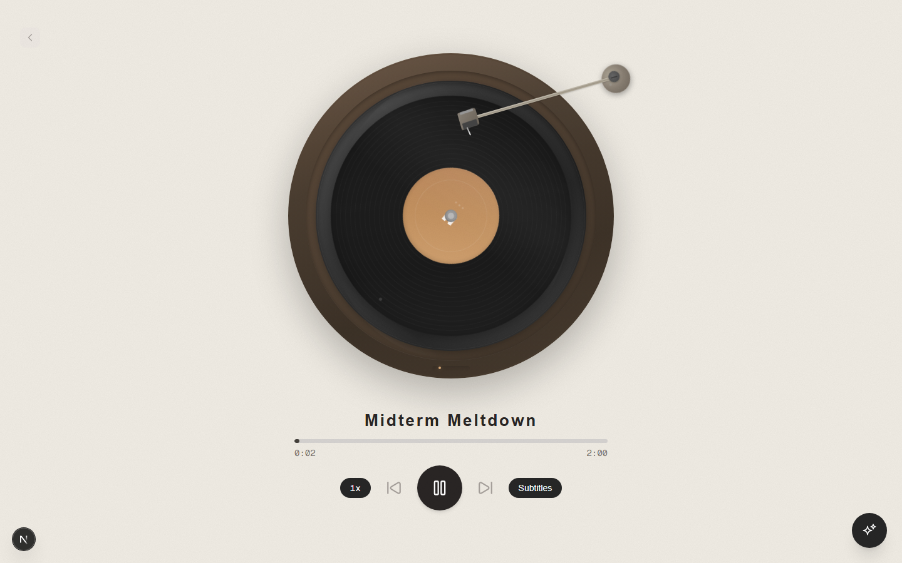&nbsp;&nbsp;
  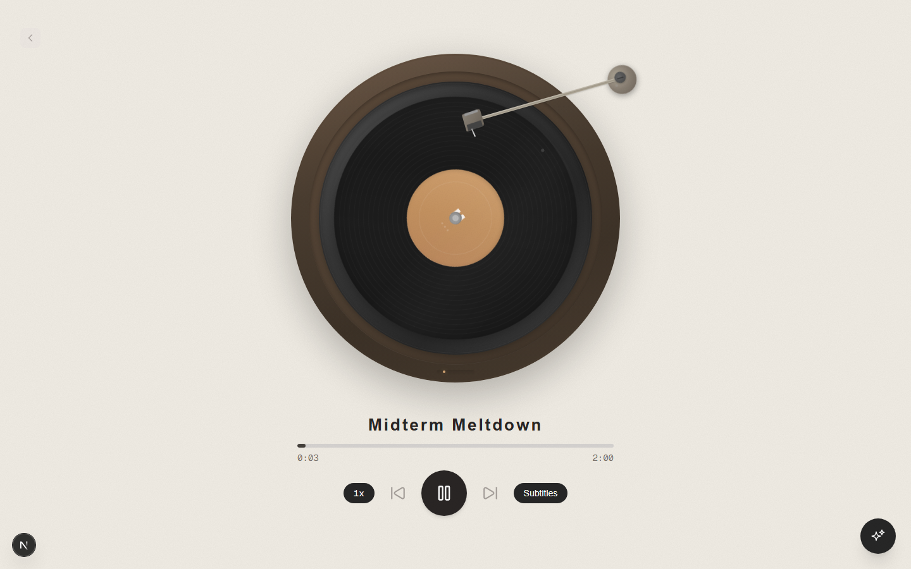
</div>

- **场景对话**：基于 A1-A5 + B 六类关系模型（闲聊 / 服务 / 亲密 / 权力 / 陌生人 / 专业讨论），模拟真实对话
- **知识听力**：C1 TED 风格单人叙述 + C2 播客风格专家访谈
- DeepSeek 实时生成新场景，按需自动补货
- TTS 音频逐行播放，中英对照

### 🤖 AI Coach — 口语对练
<div align="center">
  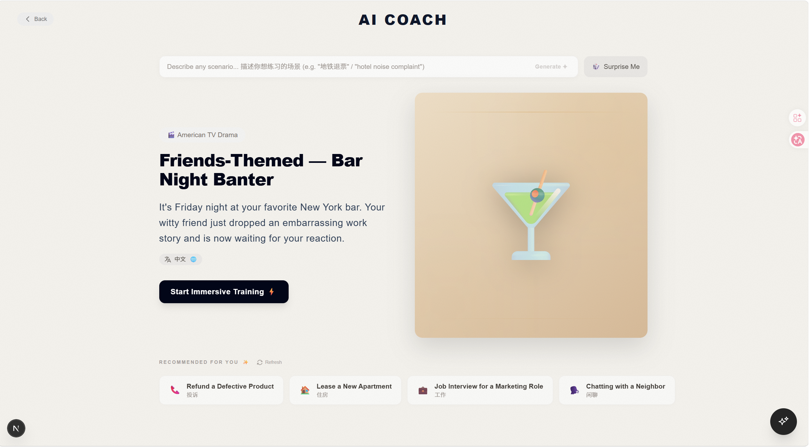&nbsp;&nbsp;
  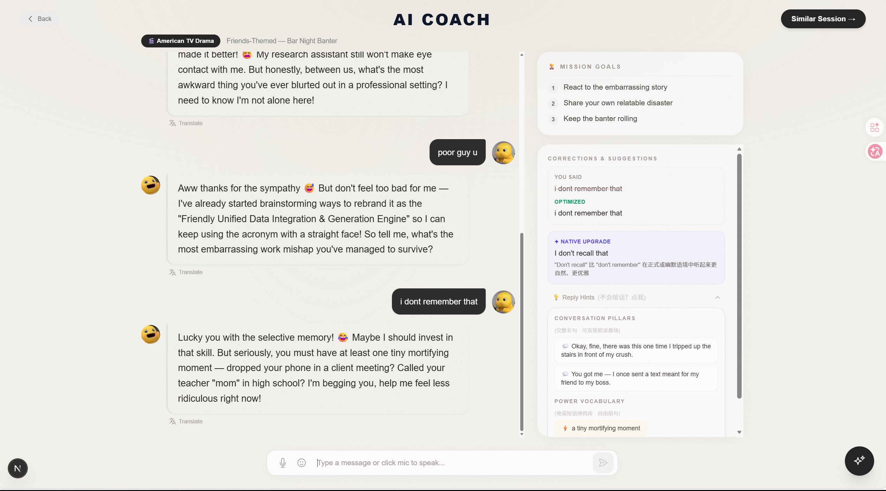
</div>

- 情景口语练习，自然对话，随时可以结束
- 场景系统：DeepSeek 按主题生成练习场景
- 智能推荐防茧房，语音输入（手动触发）
- 对话审计面板，回溯每一轮表现

### ✨ AI Assistant — 全局悬浮助手
<div align="center">
  
</div>

- **全局悬浮球**，任意页面随叫随到
- 查单词、问语法、翻译、用法辨析，即问即答
- 结构化单词卡片：音标、词性、释义、搭配一目了然
- 可拖拽位置，自动记忆

<br/>

## 🚀 Quick Start

### 前置条件

- **Node.js 20+**
- 一个 **Neon PostgreSQL** 数据库（免费，去 [neon.tech](https://neon.tech) 注册）
- 一个 **DeepSeek API Key**（去 [platform.deepseek.com](https://platform.deepseek.com) 注册充值，几块钱用很久）

### 1. 克隆并安装

```bash
git clone <仓库地址>
cd english-web
npm install          # 自动跑 prisma generate
```

### 2. 配置环境变量

```bash
cp .env.example .env
```

填入你的 `DATABASE_URL` 和 `DEEPSEEK_API_KEY`。

### 3. 建表 + 灌数据

```bash
npx prisma migrate deploy   # 建表（几秒）
npm run seed                # 灌数据（约 2 秒）
```

seed 走快速通道：直接读取 `complete_seed_data.json`，导入 **2000 IELTS 词汇 + 849 主题词**，无需下载词典、无需调用 AI。

### 4. （可选）预填所有听力场景

听力模块有 **5 个示例场景**（含音频）已自带，开箱可听。其余 35 个子类需要批量生成一次场景和音频：

```bash
npx tsx scripts/generate-listening-dialogue.ts
```

这个过程会调用 DeepSeek API 生成场景文本 + Edge TTS 合成音频。音频是主要耗时——每个场景根据行数不同约 30-90 秒，总共预计 **2-3 小时**。可以挂着让它跑，或者分多次运行（脚本是幂等的，已生成的不会重复）。

> 你也可以跳过这步，直接用 5 个示例场景开始学习。后续每听完一个场景，系统会自动补充新场景（含音频）。

### 5. 启动

```bash
npm run dev
```

打开 [http://localhost:3000](http://localhost:3000) 即可使用。

### 开箱即用的功能

| 功能 | 状态 |
|------|------|
| 词汇 SRS（2000 词 + 20 主题词包） | ✅ 立即可用 |
| Reading（已有文章） | ✅ 数据库里已有数据 |
| AI Coach 口语对练 | ✅ 可用，对话时调用 DeepSeek |
| AI Assistant 悬浮球 | ✅ 可用 |
| 听力（5 个示例场景） | ✅ 含音频，直接听 |
| 听力（其他 35 个子类） | 需运行批量生成脚本，或系统按需自动补充 |

### 按需使用的脚本

| 命令 | 说明 |
|------|------|
| `npx tsx scripts/reading-push.ts` | 手动推送最新 Reading 文章 |
| `npx tsx scripts/generate-listening-dialogue.ts` | 批量生成所有子类的听力场景（含音频，首次克隆后建议跑一次） |
| `npx tsx scripts/generate-listening-audio.ts` | 单独为已有场景补全音频（跳过已有音频） |

> **Reading 自动更新**：本项目通过 GitHub Actions 定时（每天 4 次）运行 `reading-push.ts`，自动抓取最新的 The Conversation 文章并推送至 Neon 数据库。如果你 fork 了项目，需要在自己仓库的 Settings → Secrets 中配置 `DATABASE_URL` 和 `DEEPSEEK_API_KEY`，Actions 会自动启用。

<br/>

## 🏗️ Tech Stack

| Category | Technology |
| --- | --- |
| **Framework** | Next.js 16 (App Router) |
| **Language** | TypeScript 5 |
| **Styling** | Tailwind CSS v4 |
| **Database** | PostgreSQL (Neon Serverless) |
| **ORM** | Prisma 7 |
| **AI** | DeepSeek Chat API (json_object mode) |
| **Animation** | GSAP, Motion, Three.js / OGL |
| **TTS** | Edge TTS (node-edge-tts) |
| **Audio** | Kokoro.js |

<br/>

## 📁 Project Structure

```
src/
├── app/                      # Next.js App Router
│   ├── coach/                # AI Coach 口语对练
│   ├── listening/            # 精听模块页面
│   ├── reading/              # Reading 模块
│   └── words/                # 词汇 SRS + 主题词包
│
├── features/
│   └── listening/            # 精听业务逻辑（组件 + lib）
│       ├── components/       # SectionRow, ListSection, 等
│       └── lib/              # DeepSeek prompt 模板、场景生成
│
├── components/               # 全局共享 UI（AI Assistant, 动画组件等）
├── lib/                      # 共享工具（Prisma client, types, utils）
├── data/                     # 静态配置数据
├── generated/prisma/         # Prisma Client 输出
└── scripts/                  # CLI 工具脚本
```

<br/>

## 📜 Scripts

| Command | Description |
| --- | --- |
| `npm run dev` | 启动开发服务器 |
| `npm run build` | 生产构建 |
| `npm run seed` | 初始化数据库（词汇 + 分类） |
| `npm run push:reading` | 推送 Reading 文章 |
| `npx tsx scripts/generate-listening-dialogue.ts` | 批量生成听力场景（含音频） |
| `npx tsx scripts/generate-listening-audio.ts` | 批量补全场景音频 |
| `npx tsx scripts/reset-srs.ts` | 重置 SRS 记忆数据 |

<br/>

## 🧭 Design

- 暖色调 **#F8F6F4** 基底，极简柔和
- 圆角 + 微阴影，低干扰高专注
- 渐进式动画（GSAP / Motion），不喧宾夺主
- Mobile-friendly 响应式布局


<br/>

---

<div align="center">
  <p>Built with Next.js, TypeScript & DeepSeek</p>
</div>
